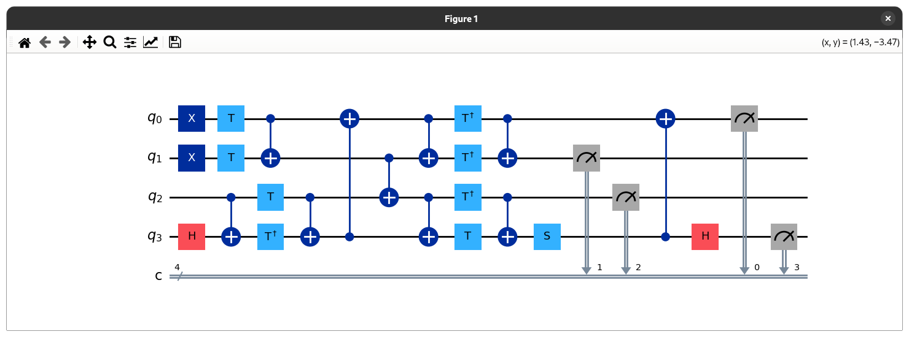
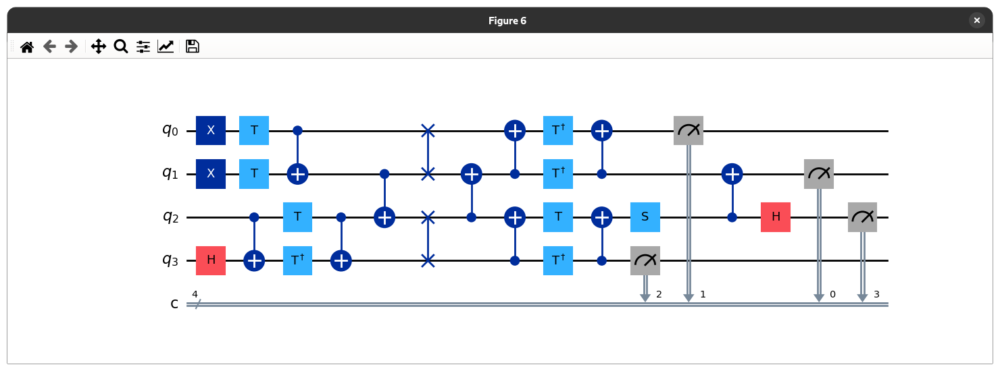
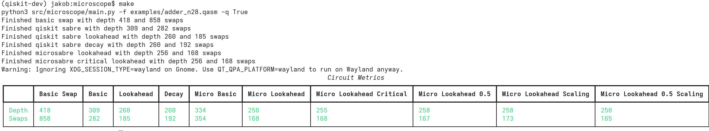
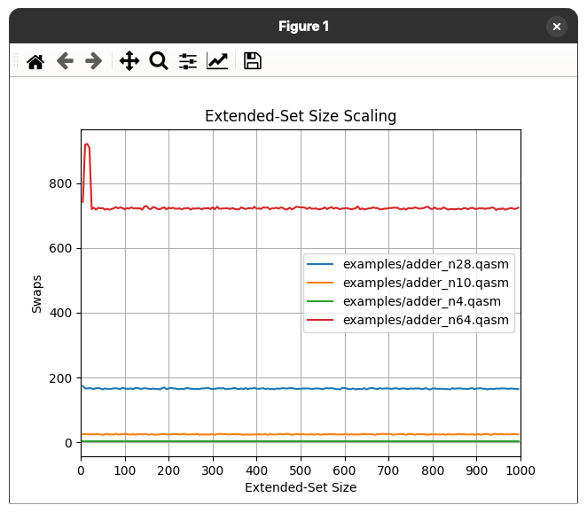
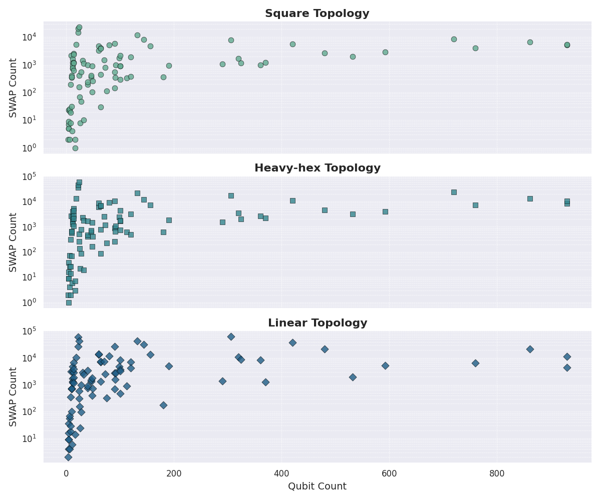
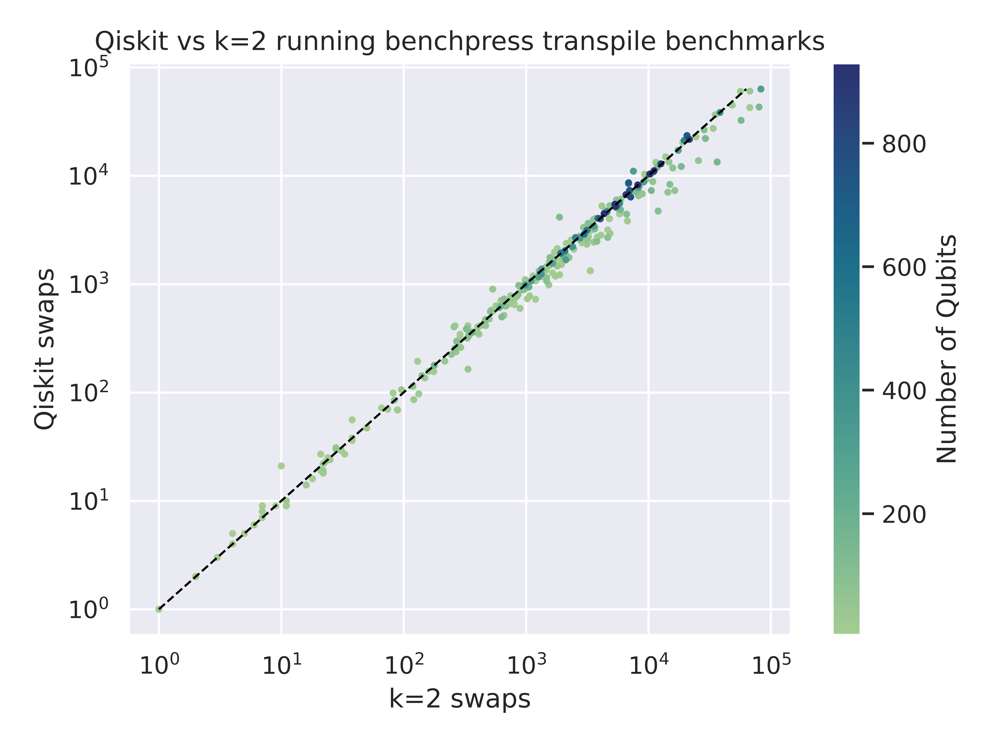
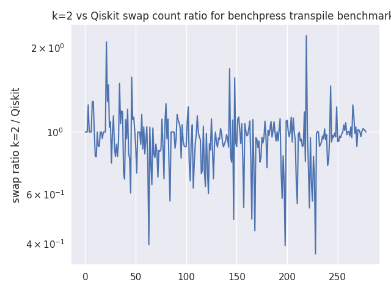

# microscope

## The Qubit Mapping Problem

In order to transpile quantum circuits, so-called SWAP gates need to be
inserted into the circuit in order to support two-qubit operations between two
logical qubits. During the process of inserting SWAPs, the precedence relations
defined in the DAG have to be respected.

### Example

The following circuit resembles a 4-qubit adder that is given as an input
circuit.

The circuit below shows the result when transpiling the circuit using the SABRE
algorithm based on a trivial initial mapping.

## Constraints

This implementation aims to solve the qubit mapping problem in an abstracted
way by adhering to the following constraints:

- No three- or more qubit-gates. This implementation limits itself to the usage
  of two-qubit gates.
- No barriers. The implementation limits itself to using a single circuit.
- No control flow

What this research is trying to achieve is to tackle the problem based on the
following assumptions:

- The input circuit has an arbitrary number of qubits
- The QPU can have an arbitrary topology

## Benchmarks

The examples are taken from
[here](https://github.com/pnnl/QASMBench/blob/master/large/adder_n28/adder_n28.qasm).

## MicroSABRE

The main goal of this chapter is to provide an intuitive understanding about
the inner workings of the MicroSABRE algorithm and what it adds onto the SABRE
algorithm.

1. Initialize initial front layer. Do this by executing all gates that have no
   predecessors. In the end, add the gates to the front layer that cannot be
   executed but have no predecessors.

2. While there are gates in the front layer and none of those gates can be
   executed, choose the best swap using a heuristic function. Apply the swap
   and check for executable gates again. Repeat this process until at least one
   gate can be executed.

3. After having found a gate that can be executed, store the sequence of swaps
   that was necessary to be able to execute the gate(s) with the first gate
   that was able to execute. Execute the gates that can be executed using the
   sequence of swaps identified. Advance the front layer as done in step 1.

Identifying the best swap is the central piece in the SABRE algorithm. To
achieve this, all swap candidates (all possible swaps that can be made with
qubits involved in the front layer) are computed. All possible candidates are
then rated using a heuristic function. The swap that leads to the best
improvement is then chosen to be applied to the circuit.

In the case of MicroSABRE, in addition to the swap candidates, the swap
candidates that lie on the longest critical path of the circuit are identified.
After the heuristic function has rated all the possible swap candidates, the
weight of the swap candidates on the critical path is increased by a constant
factor in order to take the critical path into account.

Other than that, MicroSABRE uses constant or scaled lookahead depending on the
configuration. It still has to be tested which configuration yields the best
results.

The implementation of determining the extended set (compared to the Qiskit
implementation) also considers the first layer of gates that cannot be executed
inside of the extended set. This improves the result in that not only positive
outcomes are considered inside of the heuristic. Furthermore, MicroSABRE
introduces are visited array that prevents some unnecessary processing when
considering a node multiple times.

## Ideas

- [ ] Comments, Naming, Types
- [ ] Is there still a use for the lookahead heuristic or can we focus on local changes in that case?
- [ ] Properly understand the SABRELayout and what it means to have a reversible circuit
- [ ] Do we converge eventually?
- [ ] Consider tweaking the heuristic
   - Number of branches in weighting
   - score / num_swaps
   - decay
- [ ] Matt Treinish Quantum Computing Slides
- [ ] I'd like to show that my technique is better than qiskit's and you can invest abitrary amounts of time to get better results
- [ ] Pre-allocate vectors with a certain size .reserve()

## Optimal Solutions (using OLSQ)

- `adder_n10_shortened.qasm = 8`
- `adder_n10_medium.qasm = 11`
- `adder_n10.qasm = 15`:

# Results

## Benchmark Data

## Qiskit vs k=2

## Qiskit vs k=2 ratios

