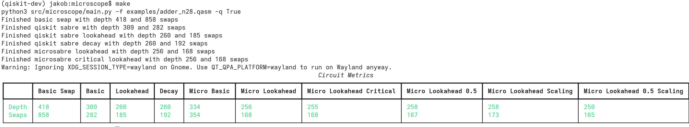
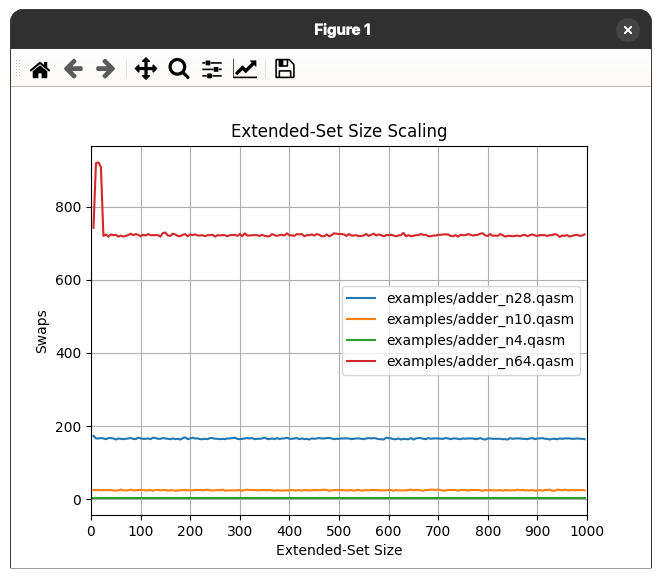
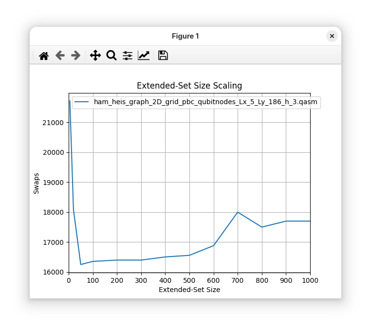
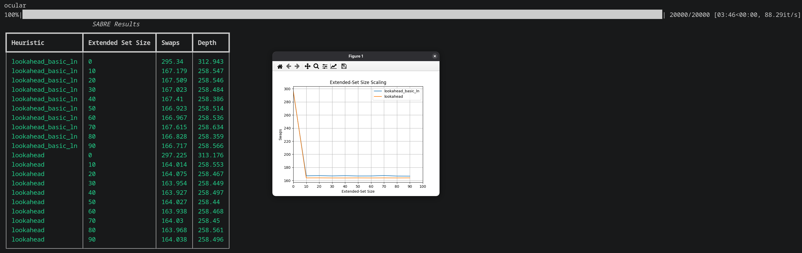

# microscope

## The Qubit Mapping Problem

In order to transpile quantum circuits, so-called SWAP gates need to be
inserted into the circuit in order to support two-qubit operations between two
logical qubits. During the process of inserting SWAPs, the precedence relations
defined in the DAG have to be respected.

### Example

The following circuit resembles a 4-qubit adder that is given as an input
circuit.

The circuit below shows the result when transpiling the circuit using the SABRE
algorithm based on a trivial initial mapping.

## Constraints

This implementation aims to solve the qubit mapping problem in an abstracted
way by adhering to the following constraints:

- No three- or more qubit-gates. This implementation limits itself to the usage
  of two-qubit gates.
- No barriers. The implementation limits itself to using a single circuit.
- No control flow

What this research is trying to achieve is to tackle the problem based on the
following assumptions:

- The input circuit has an arbitrary number of qubits
- The QPU can have an arbitrary topology

## Benchmarks

The examples are taken from
[here](https://github.com/pnnl/QASMBench/blob/master/large/adder_n28/adder_n28.qasm).

## MicroSABRE

The main goal of this chapter is to provide an intuitive understanding about
the inner workings of the MicroSABRE algorithm and what it adds onto the SABRE
algorithm.

1. Initialize initial front layer. Do this by executing all gates that have no
   predecessors. In the end, add the gates to the front layer that cannot be
   executed but have no predecessors.

2. While there are gates in the front layer and none of those gates can be
   executed, choose the best swap using a heuristic function. Apply the swap
   and check for executable gates again. Repeat this process until at least one
   gate can be executed.

3. After having found a gate that can be executed, store the sequence of swaps
   that was necessary to be able to execute the gate(s) with the first gate
   that was able to execute. Execute the gates that can be executed using the
   sequence of swaps identified. Advance the front layer as done in step 1.

Identifying the best swap is the central piece in the SABRE algorithm. To
achieve this, all swap candidates (all possible swaps that can be made with
qubits involved in the front layer) are computed. All possible candidates are
then rated using a heuristic function. The swap that leads to the best
improvement is then chosen to be applied to the circuit.

In the case of MicroSABRE, in addition to the swap candidates, the swap
candidates that lie on the longest critical path of the circuit are identified.
After the heuristic function has rated all the possible swap candidates, the
weight of the swap candidates on the critical path is increased by a constant
factor in order to take the critical path into account.

Other than that, MicroSABRE uses constant or scaled lookahead depending on the
configuration. It still has to be tested which configuration yields the best
results.

The implementation of determining the extended set (compared to the Qiskit
implementation) also considers the first layer of gates that cannot be executed
inside of the extended set. This improves the result in that not only positive
outcomes are considered inside of the heuristic. Furthermore, MicroSABRE
introduces are visited array that prevents some unnecessary processing when
considering a node multiple times.

## Ideas

- [ ] Track number of dag nodes
- [ ] Track extended set range for circuits
    - With a given limit of items in the extended set (e.g. 20), with small
      circuits, we don't actually leverage the full set. However, it is
      interesting to see that if we fill it up for every size (e.g. 930 qubits
      sample), then the best result is still at a fairly small lookahead (30 in
      that case). This indicates, that accounting for too many gates has
      diminishing returns.
        - When running the 930 qubit circuit with no limit on items in the
          extended set, it contains ~1600 items per iteration. However, this
          does not improve resuts. Now, the question is if we introduce a decay
          in the heuristic (based on critical path), can we get it to scale
          linearly
- [ ] Track avg elements in extended set
- [ ] Which elements to choose for the extended set might be relvant depending
  on which heuristic to choose
- [ ] How can we move that optimal point? Is it related to the weight we give
  the extended set?

- [ ] Finding optimal parameters probably requires categorizing the circuits
- [ ] Understand what elements are populated into the current extended set and
  the implications
    - It might not make sense to implement critical path on the current
      extended set if it only accounts for nodes that can be executed
      immediately afterwards
- [ ] The inherent randomness in the SABRE algorithm can lead to one approach
  seeming better than another one.
- [ ] What actually happens, why do we always contain the same number of gates in
  the extended set?
  - Understand the extended set
  - Implement a critical path / decay heuristic
- [ ] Why is there still a dip?
  - Understand what items are in the extended set and whether critical path can
    be applied to that?
- [ ] The extended set actually just contains all gates, that are routable assuming
  the front can be executed. If I am not mistaken, accounting for the number of
  gates in the extended set might be interesting. Also, what happens when we
  create another front at the end of the extended set?
    - Does the heuristic account for that and give more elements in the
      extended set a benefit?
- [ ] I don't want the algorithm to get stuck _ever_ cause it feels like the heuristic failed me in that case
- [ ] Layered approach, take the extended set of the extended set with a weight of 0.25 etc.
  - How does randomness behave here?
  - Is it more random than the normal lookahead?
- [ ] Decompose heuristics into separate module, since that will most likely stay the same
- [ ] Comments, Naming, Types
- [ ] Not getting stuck would also be a major improvement (liveness)
- [ ] Is there still a use for the lookahead heuristic or can we focus on local changes in that case?
- [ ] Results seem to always be divisible by the number of swaps at a time (tested on 10 qubits and 930)?
- [ ] We seem to not get stuck when using the SABRELayout stage, but we also don't seem to get an improvement anywhere?
  - Also the results do not seem random anymore
- Before investigating the layout, take a look at the heuristic first
- [ ] Properly understand the SABRELayout and what it means to have a reversible circuit
- [ ] Heuristik ist egal, irgendwas ist total falsch
- [ ] What if we used another coupling-map (like grid)

##

