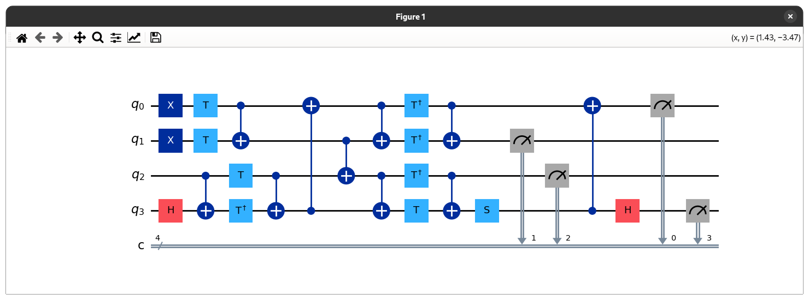
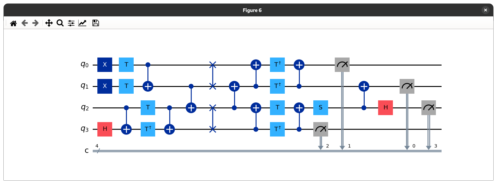

# microscope

## The Qubit Mapping Problem

In order to transpile quantum circuits, so-called SWAP gates need to be
inserted into the circuit in order to support two-qubit operations between two
logical qubits. During the process of inserting SWAPs, the precedence relations
defined in the DAG have to be respected.

### Example

The following circuit resembles a 4-qubit adder that is given as an input
circuit.

The circuit below shows the result when transpiling the circuit using the SABRE
algorithm based on a trivial initial mapping.

## Constraints

This implementation aims to solve the qubit mapping problem in an abstracted
way by adhering to the following constraints:

- No three- or more qubit-gates. This implementation limits itself to the usage
  of two-qubit gates.
- No barriers. The implementation limits itself to using a single circuit.

What this research is trying to achieve is to tackle the problem based on the
following assumptions:

- The input circuit has an arbitrary number of qubits
- The QPU can have an arbitrary topology

## Benchmarks

The examples are taken from
[here](https://github.com/pnnl/QASMBench/blob/master/large/adder_n28/adder_n28.qasm).
